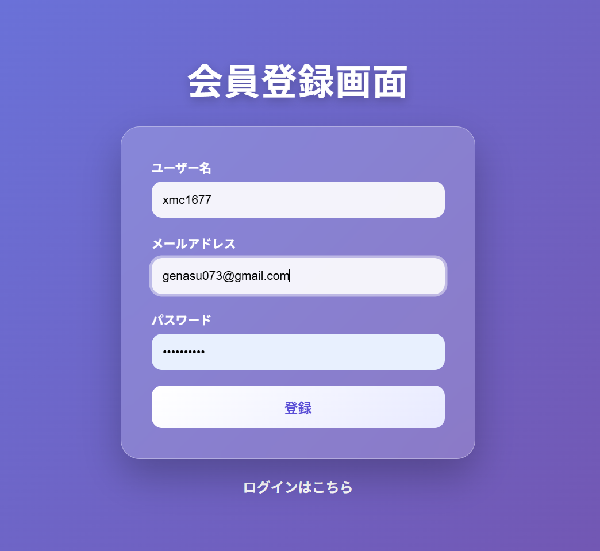
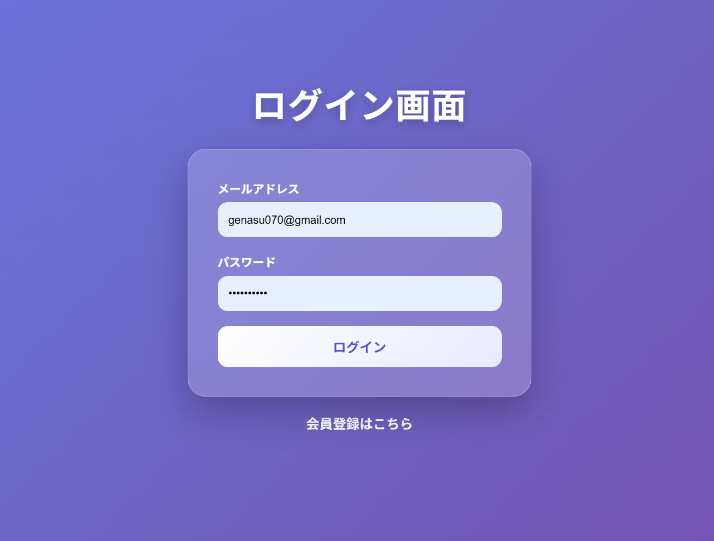
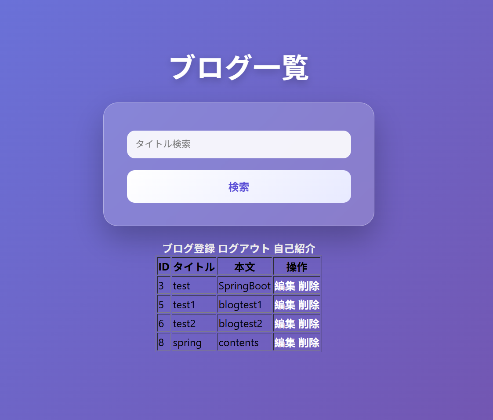
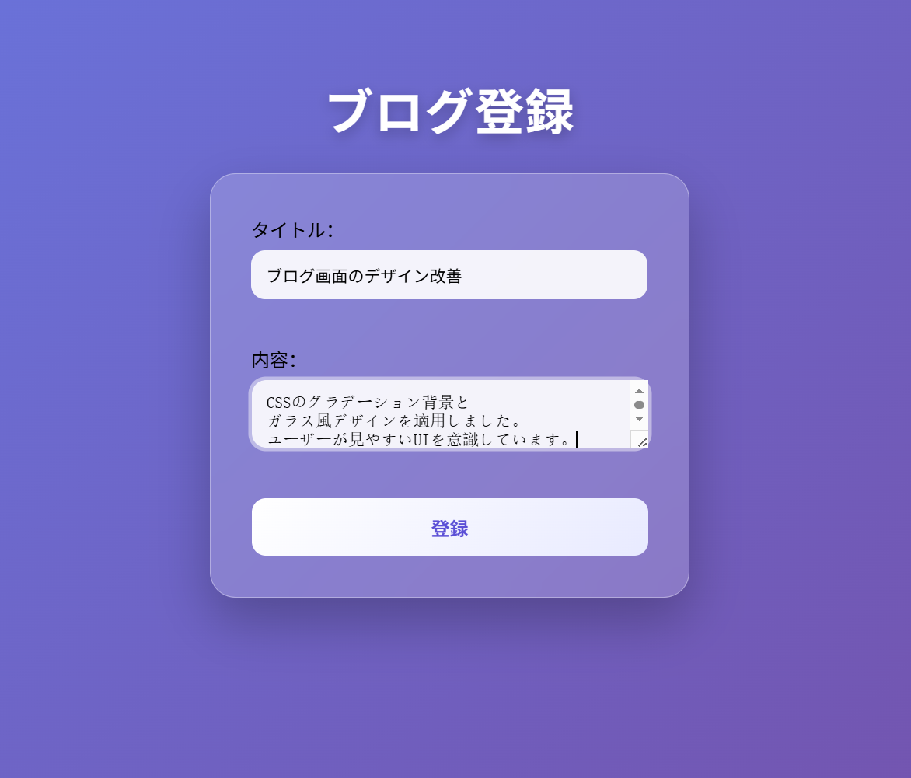
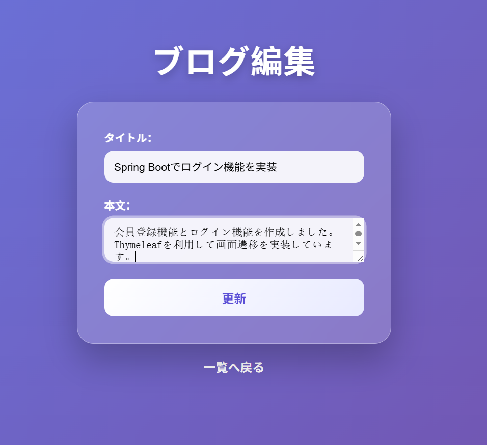
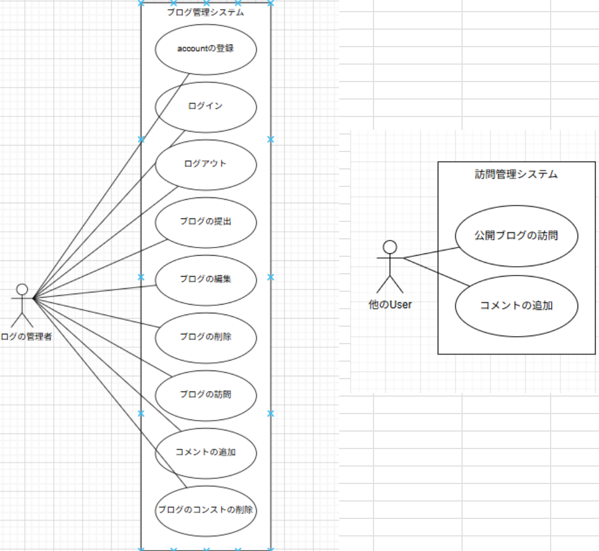

<div id="top"></div>

# 📘 自作ブログアプリ「Blog-App-XU_MINGCHENG」

<p align="center">
  
  
  
  
  
</p>

---

## 📚 目次

1. [プロジェクト概要](#プロジェクト概要)
2. [使用技術](#使用技術)
3. [画面イメージ](#画面イメージ)
4. [ユースケース図](#ユースケース図)
5. [テーブル設計](#テーブル設計)
6. [URL設計](#url設計)
7. [ディレクトリ構成](#ディレクトリ構成)
8. [工夫した点](#工夫した点)
9. [今後の課題](#今後の課題)
10. [作成者情報](#作成者情報)

---

## 🧩 プロジェクト概要

Spring Bootを使用して開発した個人用ブログアプリです。ユーザーはログインして記事を投稿・編集・削除・検索でき、他ユーザーの投稿にコメントを残すことも可能です。

---

## ⚙️ 使用技術

- バックエンド：Java 17 / Spring Boot / JPA
- フロントエンド：HTML / CSS / JavaScript / Thymeleaf
- データベース：PostgreSQL
- ビルド・管理：Maven / GitHub
- IDE：IntelliJ IDEA

---

## 🖼 画面イメージ

### 会員登録画面


### ログイン画面


### 投稿一覧画面


### 記事投稿フォーム


### ブログ編集画面

---

## 🧭 ユースケース図


---

## 🗃 テーブル設計

```sql
-- users テーブル
id            SERIAL PRIMARY KEY
username      VARCHAR(50) UNIQUE NOT NULL
password      VARCHAR(255) NOT NULL

-- posts テーブル
id            SERIAL PRIMARY KEY
title         VARCHAR(100) NOT NULL
content       TEXT NOT NULL
author_id     BIGINT FOREIGN KEY (users.id)
created_at    DATETIME

-- comments テーブル
id            SERIAL PRIMARY KEY
content       TEXT
post_id       BIGINT FOREIGN KEY (posts.id)
user_id       BIGINT FOREIGN KEY (users.id)
created_at    DATETIME
```

---

## 🌐 URL設計

- `/register`：ユーザー登録画面（GET, POST）
- `/login`：ログイン画面（GET, POST）
- `/posts`：記事一覧（GET）
- `/posts/new`：投稿フォーム（GET, POST）
- `/posts/{id}`：記事詳細（GET）
- `/posts/{id}/edit`：記事編集（GET, POST）
- `/posts/{id}/delete`：記事削除（POST）
- `/search?keyword=xxx`：記事検索（GET）

---

## 📂 ディレクトリ構成

```
src/
├── controller       // 各種コントローラ
├── entity           // JPAエンティティ
├── repository       // データベース操作
├── service          // 業務ロジック
├── templates        // Thymeleafテンプレート
├── static           // CSSやJSなど静的ファイル
└── security         // Spring Security設定
```

---

## 💡 工夫した点

- Spring Boot + Thymeleaf を使用して
  MVCモデルで画面と処理を分離した

- PostgreSQL と JPA を利用し、
  データベース操作を簡潔に実装した

- タイトル検索機能を追加し、
  ユーザーが記事を探しやすいよう改善した

- CSSでグラデーション背景と
  ガラス風デザインを実装し、
  UI/UXを向上させた

- コメント機能と自己紹介画面を追加し、
  ブログアプリとしての機能性を拡張した

- CRUD機能
 （登録・一覧表示・編集・削除）
  を実装し、基本的なブログ管理を可能にした
---

## 🧪 今後の課題

- Spring Security を導入し、
  認証・認可機能を強化する

- 入力チェック
 （バリデーション）
  を追加して安全性を向上させる

- ページネーション機能を追加し、
  大量データに対応する

- 画像投稿機能を追加し、
  表現力の高いブログに改善する

- レスポンシブ対応を行い、
  スマートフォンでも見やすくする

- Docker や AWS を利用して
  デプロイ環境を構築する

---

## 👤 作成者情報

- 氏名：徐 銘澄
- 所属：ミズトミコンサルティング株式会社
- 開発言語：Java / Spring Boot
- GitHub：https://github.com/ask861/Blog-App-XU_MINGCHENG
